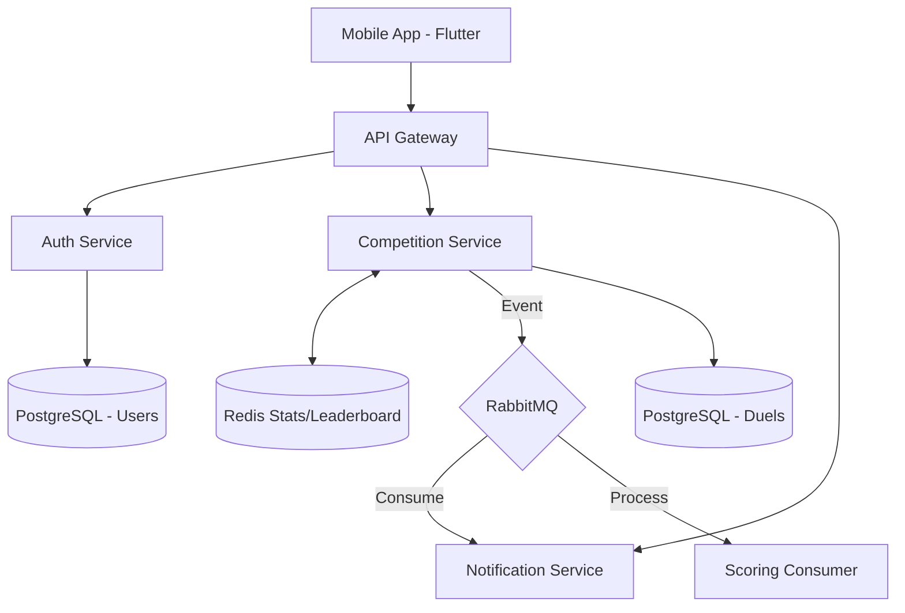

[README_SHOWCASE.md](https://github.com/user-attachments/files/24981873/README_SHOWCASE.md)
# Style Duel (Outfit Battle)

**Style Duel** is a high-performance, fashion-centric social competition platform where users participate in real-time "Outfit Battles." The system is built on a scalable microservices architecture designed to handle high-concurrency voting events, real-time matchmaking, and dynamic leaderboard updates.

---

## System Architecture

The project follows a distributed microservices pattern, ensuring high availability and fault tolerance through service discovery and centralized routing.



### Infrastructure & Discovery
*   **API Gateway (Spring Cloud Gateway):** Single entry point handling Reactive routing, JWT-based authentication, and global Rate Limiting.
*   **Discovery Server (Netflix Eureka):** The nervous system of the architecture. It enables **dynamic service discovery**, allowing services to find each other without hardcoded IPs. This is critical for:
    - **Client-Side Load Balancing:** Integrating with Spring Cloud LoadBalancer to distribute traffic across multiple service instances.
    - **Health Monitoring:** Automatically removing unhealthy instances from the registry to ensure high availability.
    - **Decoupled Scaling:** Allowing services to scale horizontally with zero-configuration updates to the Gateway routing table.
*   **Auth Service:** Enterprise identity management, handling secure session control, OAuth2 resource server integration, and user profile management.
*   **Competition Service:** The core engine managing outfit duels, real-time Elo-based matchmaking, and high-frequency voting processing.
*   **Notification Service:** Asynchronous event consumer that manages real-time push notifications (Firebase FCM) and automated email delivery.

---

## Engineering & Performance

### High-Frequency Voting (Redis Deep Dive)
To support massive concurrency during popularity peaks, the voting logic is offloaded to **Redis** using atomic operations:
*   **Sorted Sets (ZSET):** Used for real-time leaderboards (`competition:{id}:leaderboard`), enabling $O(\log N)$ ranking updates and retrieval.
*   **Hashes:** Storing granular outfit statistics (`outfit:{id}:stats`) like win/loss counts and current Elo scores.
*   **Sets:** Implementing a **Write-Behind Caching** strategy. Dirty IDs are tracked in Redis Sets, allowing batch synchronization to the primary PostgreSQL database to reduce I/O overhead.
*   **Rate Limiting:** Sliding window rate limiting implemented via Redis to prevent bot-driven voting manipulation.

### Event-Driven Ecosystem (RabbitMQ)
Asynchronous communication ensures that the user-facing API remains responsive even under heavy load:
*   **Vote Processing:** When a vote is cast, a `VoteMessage` is published to RabbitMQ. The `VoteConsumer` processes Elo scoring deltas and updates Redis stats out-of-band.
*   **User Lifecycle Events:** Actions like blocking or reporting trigger events consumed by the Notification service to adjust notification preferences instantly.
*   **Email Workflows:** Heavy operations like verification emails are handled as background workers to ensure zero latency for the end-user.

---

## Technical Stack

### Backend
- **Core:** Java 21, Spring Boot 3.2.5
- **Security:** Spring Security (OAuth2, JWT), R2DBC (Gateway context), Bucket4j (Rate Limiting)
- **Data Access:** Spring Data JPA, Hibernate, PostgreSQL
- **Middleware:** Redis (Native & Reactive), RabbitMQ (AMQP)
- **Validation:** Hibernate Validator, Lombok
- **Observability:** Spring Boot Actuator, Enterprise JSON Logging

### Frontend (Mobile)
- **Framework:** Flutter (Dart)
- **Architecture:** BLoC / Provider Pattern
- **Messaging:** Firebase Cloud Messaging (FCM)

---

## Database Management

The system utilizes **PostgreSQL** as its primary relational store, chosen for its ACID compliance and powerful indexing capabilities. 
*   **Schema Logic:** Separation of concerns between `users_db` (identities/sessions) and `competition_db` (duels/outfits).
*   **Integrity:** Relations are modeled to support complex queries for matchmaking while maintaining strict constraints on competition state.

---

## Project Structure

Style Duel adheres to a professional **Layered Architecture** across all services, ensuring strict separation between infrastructure adapters and business domain logic.

### Auth Service
```text
com.outfitvs.auth
├── config/           # Security, Jakarta & RabbitMQ Configurations
├── controller/       # Auth & User REST Endpoints
├── dto/              # Request/Response payloads (DTOs)
├── entity/           # User, Session & Token JPA Entities
├── repository/       # PostgreSQL Data Access Objects
├── security/         # JWT Filters & RBAC Implementations
├── service/          # Identity & Authentication Logic
└── common/           # Cross-cutting concerns & Shared Utils
```

### Competition Service
```text
com.outfitvs.demo
├── config/           # Redis & RabbitMQ Bean Definitions
├── controller/       # Duel & Leaderboard Controllers
├── dto/              # Competition-specific DTOs
├── entity/           # Outfit, Duel & Competition Entities
├── messaging/        # Vote Event Consumers (Asynchronous Processing)
├── repository/       # Data Access (PostgreSQL)
├── service/          # Matchmaking, Elo Scoring & Rate Limmiter
├── scheduler/        # Recurring Competition Tasks
└── infrastructure/   # Redis Service & High-Performance Adapters
```

### Notification Service
```text
com.example.notification_service
├── config/           # Firebase (FCM) & Mailer Configs
├── consumer/         # Email & Push Notification Event Listeners
├── controller/       # Token Management & Notification History
├── dto/              # Messaging payloads
├── model/            # Notification & Device Token Entities
├── repository/       # History Storage (MS-SQL/PostgreSQL)
└── service/          # FCM Push Logic & Template Management
```

### API Gateway
```text
com.outfitvs.gateway
├── config/           # Route Definitions & CORS Policies
├── filter/           # Global Logging & Auth Filters
└── security/         # Reactive JWT Validation Logic
```

---

## Key Engineering Decisions
1.  **Stateless Identity:** Leveraged JWT for horizontal scaling of microservices without session affinity.
2.  **Elo Scoring System:** Implemented a fair competition model where score gains depend on the opponent's relative strength.
3.  **Reactive Gateway:** Used Spring Cloud Gateway (Project Reactor) to handle thousands of concurrent requests with minimal resource usage.
4.  **Async Decoupling:** Every write-heavy operation is decoupled via MQ to ensure 99.9th percentile latency remains stable.

---
*Note: This repository contains high-level documentation and architectural overview. Source code is confidential/restricted.*
